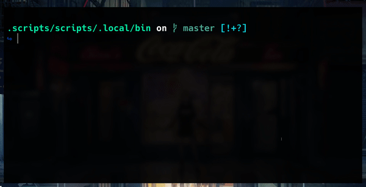

# My Dotfiles
These are the dotfiles for my (Arch) Linux setup (optionally) deployed and managed with [GNU Stow](https://www.gnu.org/software/stow/). Included are the configurations for programs such as neovim, zsh, tmux, etc.


# Table of Content
<!-- vim-markdown-toc GFM -->

* [Intro](#intro)
* [Usage](#usage)
	* [Stow](#stow)
* [Rice](#rice)
	* [Neovim](#neovim)
	* [zsh](#zsh)
	* [herbstluftwm](#herbstluftwm)
	* [tmux](#tmux)
* [Contact](#contact)

<!-- vim-markdown-toc -->

# Intro

So what exactly is the purpose of this repo? The answer is similar to the reason why r/unixporn exists, to make fellow ricers happy :D.  

I provide some commentary for _some_ of the tools I use in the Rice section. Not everything will work right out the box. For one I assume you know how to install the relevant 'packages' onto your system. For some of the programs I've (deliberately) changed the location(s) of where config files are housed, I'll typically state this in the config file itself. So please refer to the config file in such circumstances.

# Usage

You have two options. Simply copy-pasta what you need from the relevant files, or you can install and use [GNU Stow](https://www.gnu.org/software/stow/). If you are unfamiliar with `stow` then follow the instructions below.

## Stow
The files in this repo are organized as such so as to make deployment convenient. Clone this repo to your home directory with `git-clone`:

```bash
$ git clone https://github.com/sarrost/dotfiles
```

Enter the root of the directory:

```bash
$ cd ~/dotfiles
```

Then run the following command:

```bash
$ stow <dir>
```

This will deploy the config files for application '`dir`' by creating symlinks.

__NOTE__: Deleting the original file in the 'repo' directory will break the link between the file and symlink without destroying the deployed link. Basically, always delete both files when doing cleanup.

# Rice

This section is titled rice because I couldn't decide if I should have titled it either 'Programs', 'Applications', or 'Tools'. So I went with neither.  

The complete list of programs/tools/applications that have 
configurations present in this repo: 
[calcurse](https://calcurse.org/), 
[compton](https://github.com/chjj/compton), 
[dunst](https://dunst-project.org/), 
[herbstluftwm](https://herbstluftwm.org/), 
[mpd](https://www.musicpd.org/), 
[ncmpcpp](https://rybczak.net/ncmpcpp/), 
[neomutt](https://neomutt.org/), 
[nvim](https://neovim.io/), 
[ranger](https://ranger.github.io/), 
[rofi](https://github.com/davatorium/rofi), 
[sxhkd](https://github.com/baskerville/sxhkd), 
[tmux](https://github.com/tmux/tmux/wiki), 
[xorg](https://www.x.org/wiki/), 
[zathura](https://pwmt.org/projects/zathura/)

## Neovim

## [zsh](https://www.zsh.org/)


All configuration files are stored in `~/.config/zsh`. This 
is not default behaviour.

Configured with some cool plugins and features such as:

||
|:--:| 
| FZF (bindkey) integration |

||
|:--:| 
| (Menu enabled) completion |

||
|:--:| 
| Syntax highlighting |

||
|:--:| 
| Notifications for time consuming commands upon completion |

## herbstluftwm

## tmux

# Contact

Feel free to contact me at `herbert.magaya@protonmail.com` 
if you have any questions or something isn't working 
properly for you.

Also feel free to use the Issues board if something is
legitimately broken.
