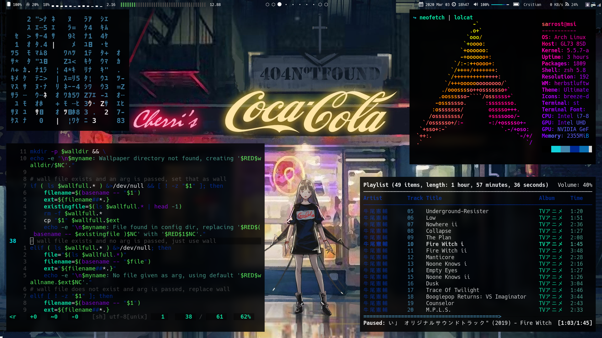

# My Dotfiles

The configuration files for my GNU/Linux setup.



# Usage

You have three options. 

1. Simply copy-pasta what you need from the relevant files 
2. [Recommended] Use the provided `dot.sh` script. ([GNU Stow](https://www.gnu.org/software/stow/) required)
3. Install and use GNU Stow. The `dot.sh` is a wrapper script for `stow`.

## Using dot.sh
The files in this repo are organized as such so as to make deployment convenient. Clone this repo to any directory with `git-clone` and enter the dotfiles directory within the repo:

```shellscript
	git clone https://github.com/sarrost/dotfiles
	cd dotfiles/dotfiles
```

Then run the following command:

```shellscript
	./dot.sh <dir>
```

This will deploy the config files for application '`dir`' by creating symlinks.

__NOTE__: Deleting the original file in the 'repo' directory will break the link between the file and symlink without destroying the deployed link. Basically, always delete both files when doing cleanup.

For a full list of options run:

```shellscript
	./dot.sh -h
```

Which will print the following:

```
Usage:
  ./dot.sh [OPTIONS] dir
Options:
  -I,--install [program] --  install program
  -i,--deploy [program]  --  deploy dotfiles
  -r,--recall [program]  --  recall dotfiles
  -R,--uninstall [program]  -- uninstall program
  -s,--silent            --  silent output
  -v,--verbose           --  verbose output
  -h,--help              --  print this help message

  Option -i is assumed if no options are given.

  Prepend directory with 'sys-' (e.g. sys-portage) to
  deploy/recall system-wide (e.g. /etc/portage/).
  
  Need to run as root when using -I and -R. Running
  -i and -r as root deploys/recalls dotfiles to/from
  /root/. Recalling leaves behind empty folders.
```

Installing /uninstalling programs only works on gentoo at the moment. I plan to add support for FreeBSD in the future.

# Contact

Feel free to contact me at `herbert@magaya.co.za` if you have any questions or something isn't working properly for you.

Also feel free to use the issues board if something is broken or confusing. Have a nice day :^)
